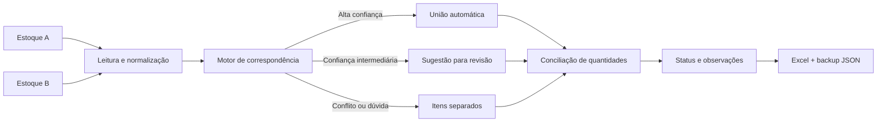

<div align="center">

# Conciliador de Estoque PRO

### Auditoria de estoque, conciliação inteligente e registro de tratativas diretamente no navegador


</div>

## Visão geral

O **Conciliador de Estoque PRO** foi criado para reduzir o trabalho manual de comparar duas bases de estoque e concentrar a atenção exatamente onde existe divergência.

A aplicação lê arquivos de estoque, normaliza descrições, consolida itens repetidos, cruza os dois lados, classifica diferenças e mantém uma memória local das decisões tomadas durante a auditoria.

A versão **10.2** reforça principalmente três pontos: **confiabilidade do motor**, **fluidez no processamento** e **registro das tratativas diretamente no Status**.

## O que mudou na v10.2

- **Motor mais conservador:** quantidade igual deixou de ser motivo suficiente para união automática;
- **níveis de decisão:** correspondências de alta confiança podem ser unidas automaticamente, casos intermediários viram sugestões e conflitos permanecem separados;
- **proteção de variantes:** medidas, embalagens, números e unidades incompatíveis reduzem ou bloqueiam correspondências indevidas;
- **quantidades decimais preservadas:** o motor trata valores fracionados de estoque e usa tolerância técnica para comparação;
- **observações no Status:** clique no Status de qualquer linha para registrar, editar ou apagar uma tratativa;
- **destaque discreto:** linhas com observação recebem indicação visual sem alterar o desenho da tabela;
- **backup completo:** observações passam a fazer parte do backup JSON junto com uniões, exclusões e rejeições;
- **Excel mais completo:** a exportação inclui uma coluna de observação;
- **mais fluidez:** cache, indexação de candidatos, paginação e processamento em etapas reduzem trabalho desnecessário no navegador;
- **memória mais segura:** ciclos de união e reaprendizado de pares rejeitados são evitados.

## Como o motor decide

| Nível | Comportamento | Objetivo |
|---|---|---|
| **Alta confiança** | Pode unir automaticamente quando não há conflito crítico | Reduzir trabalho manual sem forçar correspondências frágeis |
| **Sugestão** | Aparece em **Sugestões Inteligentes** para revisão do usuário | Aproveitar semelhanças úteis mantendo controle humano |
| **Conflito ou dúvida** | Mantém os itens separados | Evitar que uma falsa união esconda uma divergência real |

Na v10.2, **mesma quantidade é apenas uma evidência adicional**. Ela não autoriza uma união sozinha.

## Fluxo da auditoria



## Observações de auditoria

O campo **Status** também funciona como ponto de tratativa da linha.

Ao clicar nele, é possível:

- escrever uma observação;
- editar uma observação existente;
- apagar a observação;
- manter a anotação salva no navegador;
- levar a anotação para o backup JSON;
- exportar a anotação junto com o resultado em Excel.

Quando os lados A e B estão conciliados, a observação acompanha aquela conciliação. Quando existe apenas um item isolado, a anotação pertence àquele item.

## Funcionalidades

- Importação de `.xlsx`, `.xls` e `.csv`;
- detecção automática de código, descrição, quantidade e unidade de medida;
- normalização de descrições e unidades logísticas;
- consolidação de produtos repetidos;
- comparação entre duas bases de estoque;
- identificação de itens que bateram, divergências e itens presentes em apenas um lado;
- quantidades decimais;
- memória de uniões manuais;
- memória de rejeições para impedir que uma sugestão incorreta volte a ser insistida;
- exclusões manuais por lado;
- sugestões de correspondência por heurística de similaridade;
- observações clicáveis no Status;
- filtros, pesquisa e indicadores de auditoria;
- paginação progressiva da tabela;
- exportação para Excel;
- exportação e importação de backup em JSON;
- tema claro e escuro;
- interface responsiva para desktop e celular.

## Tecnologias

| Camada | Tecnologia |
|---|---|
| Interface | HTML5 + Tailwind CSS via CDN |
| Motor | JavaScript ES6+ |
| Planilhas | SheetJS (`xlsx`) |
| Persistência | LocalStorage |
| Correspondência | Normalização, regras logísticas, similaridade textual e memória local |

## Como executar

```bash
git clone https://github.com/Paulo968/conciliador-estoque.git
cd conciliador-estoque
```

Depois, abra o arquivo `index.html` no navegador.

Não é necessário instalar servidor, banco de dados ou backend para processar os estoques.

## Fluxo de uso

1. Importe o arquivo do **Lado A**;
2. importe o arquivo do **Lado B**;
3. clique em **Processar Auditoria**;
4. analise os indicadores e divergências;
5. use **Sugestões Inteligentes** quando quiser revisar possíveis correspondências;
6. clique no **Status** para registrar a causa ou tratativa de uma diferença;
7. exporte o resultado para Excel;
8. exporte periodicamente o backup JSON da memória.

## Persistência e backup

A memória do conciliador fica armazenada no navegador com **LocalStorage**. Isso mantém uniões, exclusões, rejeições e observações disponíveis nos próximos usos naquele navegador.

Para trocar de computador, navegador ou manter uma cópia segura da inteligência construída durante as auditorias, use **Memória → Exportar .JSON** e depois **Importar .JSON** quando necessário.

## Privacidade e requisitos

As planilhas são processadas **no próprio navegador** e não precisam ser enviadas para um servidor da aplicação.

A interface e a biblioteca de planilhas são carregadas por CDN, portanto a primeira abertura depende de acesso aos recursos externos utilizados pelo projeto.

Use somente dados que você tenha autorização para processar e evite publicar planilhas reais de operação no repositório.

## Escopo atual

- Entradas suportadas: `.xlsx`, `.xls` e `.csv`;
- PDF ainda não faz parte da versão 10.2;
- a memória é local ao navegador, por isso o backup JSON é recomendado;
- sugestões inteligentes devem ser revisadas quando houver dúvida operacional.

## Autor

Desenvolvido por **Paulo Zaqueu**, a partir de uma necessidade prática de estoque, auditoria e operação logística.

[GitHub](https://github.com/Paulo968) · [Portfólio](https://portfolio-paulo-ashy.vercel.app/) · [LinkedIn](https://www.linkedin.com/in/paulo-zaqueu-762459187) · [E-mail](mailto:paulozaqueu3@gmail.com)
