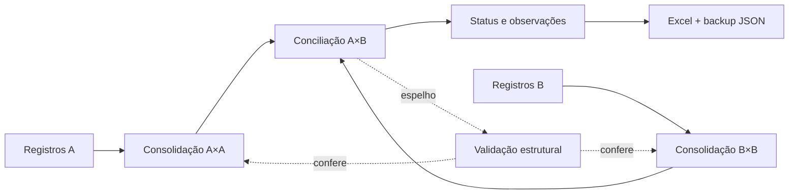

<div align="center">

# Conciliador de Estoque PRO

### Auditoria de estoque, conciliação inteligente e registro de tratativas diretamente no navegador


</div>

## Visão geral

O **Conciliador de Estoque PRO** foi criado para reduzir o trabalho manual de comparar duas bases de estoque e concentrar a atenção exatamente onde existe divergência.

A aplicação lê arquivos de estoque, normaliza descrições, consolida itens repetidos, cruza os dois lados, classifica diferenças e mantém uma memória local das decisões tomadas durante a auditoria.

O núcleo de conciliação continua baseado no **motor confiável v10.2**. Sobre ele existem camadas independentes de **fluidez**, **integridade conservadora da memória**, **tema** e, a partir da v10.5, uma **arquitetura auditável A×A → B×B → A×B**. Essas camadas evoluem a aplicação sem alterar silenciosamente as regras que decidem quando dois produtos podem ou não ser conciliados.

## Motor confiável v10.2

- **Motor mais conservador:** quantidade igual deixou de ser motivo suficiente para união automática;
- **níveis de decisão:** correspondências de alta confiança podem ser unidas automaticamente, casos intermediários viram sugestões e conflitos permanecem separados;
- **proteção de variantes:** medidas, embalagens, números e unidades incompatíveis reduzem ou bloqueiam correspondências indevidas;
- **quantidades decimais preservadas:** o motor trata valores fracionados de estoque e usa tolerância técnica para comparação;
- **observações no Status:** clique no Status de qualquer linha para registrar, editar ou apagar uma tratativa;
- **backup completo:** observações fazem parte do backup JSON junto com uniões, exclusões e rejeições;
- **Excel mais completo:** a exportação inclui uma coluna de observação;
- **indexação de candidatos:** o motor evita comparar produtos sem relação plausível;
- **memória mais segura:** ciclos de união e reaprendizado de pares rejeitados são evitados.

## Camada de fluidez v10.3

A camada de performance mantém as mesmas regras do motor e atua somente na forma como o navegador executa o trabalho:

- **Web Worker para normalização:** em bases maiores, parte do processamento pesado sai da thread da interface;
- **fallback seguro:** se Worker não estiver disponível, o processamento continua em lotes menores, cedendo tempo ao navegador;
- **cache de pré-processamento:** excluir, restaurar ou unir itens não obriga o sistema a normalizar novamente toda a base bruta;
- **processamento cooperativo:** consolidação e preparação são divididas em etapas para evitar longos períodos de tela congelada;
- **progresso no botão:** o próprio botão de auditoria informa etapas como normalização, índices, cruzamento e consolidação;
- **cache da matriz:** filtros e pesquisas reutilizam a classificação já calculada enquanto os dados da auditoria não mudam;
- **atualização pontual de observações:** salvar ou apagar uma observação atualiza apenas o Status daquela linha, sem reconstruir toda a tabela;
- **DOM controlado:** a paginação progressiva existente continua limitando a quantidade inicial de linhas renderizadas.

## Integridade conservadora da memória v10.4+

A camada de integridade foi separada do motor de correspondência para que a manutenção da memória não altere as regras da auditoria.

Registros `A → A` são **preservados**. Eles podem representar uma decisão ou marca operacional válida do histórico, inclusive situações em que um mesmo produto aparece por mais de um código e termina consolidado na mesma identidade. Uniões reais `A → B`, rejeições da IA, exclusões manuais, observações e famílias aprendidas também permanecem intactas.

A camada só descarta automaticamente entradas tecnicamente inválidas, como um destino vazio. Ela também consegue diagnosticar ciclos reais sem apagar automaticamente cadeias válidas.

Backups antigos continuam compatíveis. O backup atual é identificado como `10.5-arquitetura-auditavel`.

## Arquitetura auditável v10.5

A v10.5 torna explícito o princípio operacional:

```text
A × A  →  B × B  →  A × B  →  VALIDAÇÃO
```

### 1. Consolidação interna A — A×A

Os registros do Lado A são reunidos pela identidade final do produto. Se o mesmo produto existir em mais de um código, os códigos permanecem rastreáveis e as quantidades são somadas.

Exemplo:

```text
A100 | CALARIS 5LT | 10,500 ─┐
A200 | CALARIS 5LT |  4,250 ─┴─► CALARIS 5LT = 14,750
```

### 2. Consolidação interna B — B×B

O mesmo processo é feito de forma independente no Lado B.

```text
B010 | CALARIS 05LT | 12,750 ─┐
B020 | CALARIS 05LT |  2,000 ─┴─► CALARIS 05LT = 14,750
```

### 3. Conciliação cruzada — A×B

Somente depois das consolidações internas os produtos consolidados são comparados entre os dois sistemas.

```text
CALARIS 5LT (A) 14,750  ↔  CALARIS 05LT (B) 14,750
                         ✅ BATEU
```

### 4. Validação de conservação

A arquitetura v10.5 funciona em **modo espelho**: o motor atual continua sendo a autoridade e produz o resultado normalmente. Depois, uma camada independente reconstrói A×A, B×B e A×B e compara o que encontrou com o resultado do motor.

Ela verifica por chave se:

- o produto consolidado continua presente;
- a quantidade consolidada é exatamente a esperada dentro da tolerância técnica;
- o conjunto final A×B contém as mesmas chaves;
- o Status calculado é o mesmo;
- produtos com múltiplos códigos continuam rastreáveis.

Se a arquitetura espelho encontrar uma diferença, ela **não corrige nem esconde o resultado**. O resultado do motor é mantido e o sistema registra um alerta de validação estrutural para investigação.

O diagnóstico também pode ser consultado programaticamente por `ConciliadorArquitetura.obterUltimoDiagnostico()` e um resumo passa a acompanhar novos backups quando já houver uma auditoria validada na sessão.

## Proteção por testes de regressão

O projeto possui uma suíte sem dependências externas que carrega os próprios arquivos do motor e valida comportamentos críticos, entre eles:

- preservação de quantidades decimais;
- equivalência entre formatos `12,750` e `12.750`;
- manutenção de diferenças reais de quantidade;
- bloqueio de variantes como `1LT × 5LT`;
- garantia de que quantidade igual é apenas evidência e não autorização automática;
- preservação de `A → A` e `A → B`;
- detecção de ciclos reais sem alteração automática do dicionário;
- consolidação A×A de vários códigos sem perda de quantidade;
- consolidação B×B de vários códigos sem perda de quantidade;
- comparação A×B somente após as consolidações;
- equivalência entre a arquitetura espelho e o resultado produzido pelo motor;
- teste negativo que exige detectar uma quantidade perdida em vez de escondê-la.

Para executar localmente:

```bash
npm test
```

O workflow **Regressão do Conciliador** executa os testes em pushes para `main` e em pull requests.

## Tema v10.4

A troca entre claro e escuro foi otimizada para evitar repintura simultânea de centenas de elementos. O tema claro usa superfícies suaves em tons de slate, azul e índigo, mantendo a mesma estrutura da interface sem o excesso de branco puro.

## Como o motor decide

| Nível | Comportamento | Objetivo |
|---|---|---|
| **Alta confiança** | Pode unir automaticamente quando não há conflito crítico | Reduzir trabalho manual sem forçar correspondências frágeis |
| **Sugestão** | Aparece em **Sugestões Inteligentes** para revisão do usuário | Aproveitar semelhanças úteis mantendo controle humano |
| **Conflito ou dúvida** | Mantém os itens separados | Evitar que uma falsa união esconda uma divergência real |

**Mesma quantidade é apenas uma evidência adicional. Ela não autoriza uma união sozinha.**

## Fluxo da auditoria



## Funcionalidades

- Importação de `.xlsx`, `.xls` e `.csv`;
- detecção automática de código, descrição, quantidade e unidade de medida;
- normalização de descrições e unidades logísticas;
- consolidação de produtos repetidos e múltiplos códigos;
- comparação entre duas bases de estoque;
- identificação de itens que bateram, divergências e itens presentes em apenas um lado;
- quantidades decimais;
- memória de uniões manuais e autoapontamentos preservados;
- memória de rejeições para impedir que uma sugestão incorreta volte a ser insistida;
- exclusões manuais por lado;
- sugestões de correspondência por heurística de similaridade;
- observações clicáveis no Status;
- filtros, pesquisa e indicadores de auditoria;
- paginação progressiva da tabela;
- processamento em Web Worker quando suportado;
- cache de pré-processamento e da matriz de resultados;
- validação estrutural A×A → B×B → A×B;
- rastreabilidade de grupos com múltiplos códigos;
- exportação para Excel;
- exportação e importação de backup em JSON;
- tema claro e escuro;
- interface responsiva para desktop e celular;
- testes automáticos de regressão.

## Tecnologias

| Camada | Tecnologia |
|---|---|
| Interface | HTML5 + Tailwind CSS via CDN |
| Motor | JavaScript ES6+ |
| Performance | Web Worker, cache em memória e processamento cooperativo |
| Arquitetura | Pipeline espelho A×A / B×B / A×B + invariantes |
| Planilhas | SheetJS (`xlsx`) |
| Persistência | LocalStorage |
| Correspondência | Normalização, regras logísticas, similaridade textual e memória local |
| Qualidade | Node.js `assert` + `vm` e GitHub Actions |

## Como executar

```bash
git clone https://github.com/Paulo968/conciliador-estoque.git
cd conciliador-estoque
```

Depois, abra o arquivo `index.html` no navegador.

Não é necessário instalar servidor, banco de dados ou backend para processar os estoques. Node.js só é necessário caso você queira executar os testes de regressão com `npm test`.

## Fluxo de uso

1. Importe o arquivo do **Lado A**;
2. importe o arquivo do **Lado B**;
3. clique em **Processar Auditoria**;
4. analise os indicadores e divergências;
5. use **Sugestões Inteligentes** quando quiser revisar possíveis correspondências;
6. clique no **Status** para registrar a causa ou tratativa de uma diferença;
7. exporte o resultado para Excel;
8. exporte periodicamente o backup JSON da memória.

## Persistência e backup

A memória do conciliador fica armazenada no navegador com **LocalStorage**. Isso mantém uniões, autoapontamentos, exclusões, rejeições e observações disponíveis nos próximos usos naquele navegador.

Para trocar de computador, navegador ou manter uma cópia segura da inteligência construída durante as auditorias, use **Memória → Exportar .JSON** e depois **Importar .JSON** quando necessário.

Nenhuma decisão válida `A → A` ou `A → B` é removida automaticamente pela camada de integridade.

## Privacidade e requisitos

As planilhas são processadas **no próprio navegador** e não precisam ser enviadas para um servidor da aplicação. O Web Worker e a validação estrutural também executam localmente no dispositivo.

A interface e a biblioteca de planilhas são carregadas por CDN, portanto a primeira abertura depende de acesso aos recursos externos utilizados pelo projeto.

Use somente dados que você tenha autorização para processar e evite publicar planilhas reais de operação no repositório.

## Escopo atual

- Entradas suportadas: `.xlsx`, `.xls` e `.csv`;
- PDF ainda não faz parte da versão atual;
- a memória é local ao navegador, por isso o backup JSON é recomendado;
- sugestões inteligentes devem ser revisadas quando houver dúvida operacional;
- a arquitetura espelho valida o motor, mas não altera automaticamente uma decisão de conciliação.

## Autor

Desenvolvido por **Paulo Zaqueu**, a partir de uma necessidade prática de estoque, auditoria e operação logística.

[GitHub](https://github.com/Paulo968) · [Portfólio](https://portfolio-paulo-ashy.vercel.app/) · [LinkedIn](https://www.linkedin.com/in/paulo-zaqueu-762459187) · [E-mail](mailto:paulozaqueu3@gmail.com)