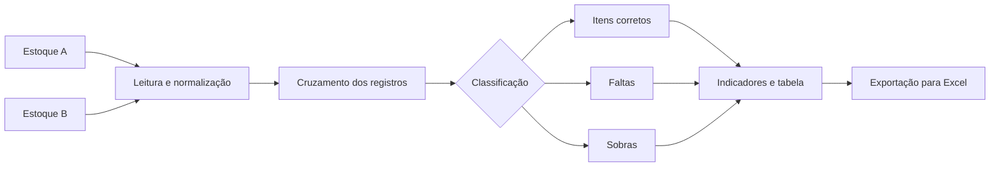

<div align="center">

# Conciliador de Estoque PRO

### Auditoria logística e comparação de bases diretamente no navegador


</div>

## Problema que o projeto resolve

Conferências de estoque feitas manualmente em planilhas costumam consumir tempo, gerar retrabalho e dificultar a identificação de faltas, sobras e diferenças entre bases.

O Conciliador de Estoque PRO permite importar dois arquivos, cruzar os dados e visualizar os resultados em uma interface responsiva com indicadores, filtros e exportação para Excel.

## Fluxo da auditoria



## Funcionalidades

- Importação de arquivos `.xlsx`, `.xls` e `.csv`;
- comparação entre duas bases de estoque;
- identificação de itens corretos, faltantes e excedentes;
- indicadores de auditoria em tempo real;
- tabela responsiva com destaque por status;
- filtros e seleção de resultados;
- exportação da conciliação para Excel;
- memória local para configurações e histórico de uso;
- importação e exportação de backup em JSON;
- temas claro e escuro;
- interface adaptada para desktop e celular.

## Tecnologias

| Camada | Tecnologia |
|---|---|
| Interface | HTML5 e Tailwind CSS via CDN |
| Processamento | JavaScript |
| Planilhas | SheetJS (`xlsx`) |
| Persistência | LocalStorage |

## Como executar

```bash
git clone https://github.com/Paulo968/conciliador-estoque.git
cd conciliador-estoque
```

Abra o arquivo `index.html` no navegador.

Como todo o processamento é executado localmente, não é necessário instalar servidor ou banco de dados para utilizar a aplicação.

## Fluxo de uso

1. Importe a planilha do estoque A;
2. importe a planilha do estoque B;
3. execute a auditoria;
4. analise os indicadores e divergências;
5. exporte o resultado para Excel quando necessário.

## Privacidade

Os arquivos são processados no próprio navegador e não precisam ser enviados para um servidor. Ainda assim, utilize apenas dados autorizados e evite publicar planilhas reais no repositório.

## Autor

Desenvolvido por [Paulo Zaqueu](https://github.com/Paulo968), com base em experiência prática em estoque, auditoria e operação logística.

[Portfólio](https://portfolio-paulo-ashy.vercel.app/) · [LinkedIn](https://www.linkedin.com/in/paulo-zaqueu-762459187) · [E-mail](mailto:paulozaqueu3@gmail.com)
